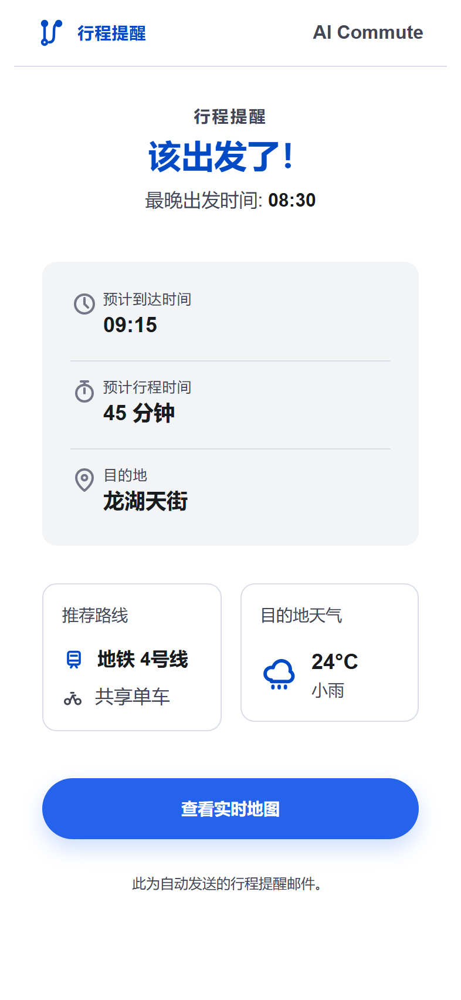
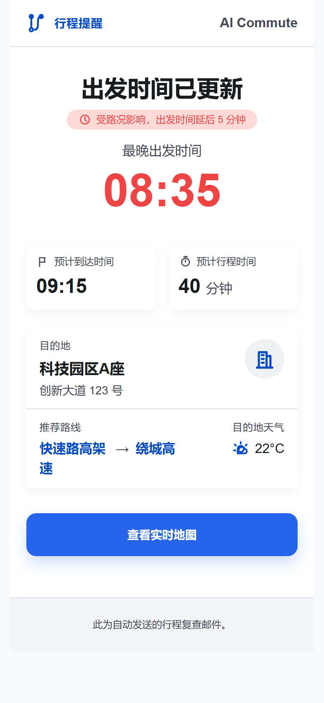

# AI Commute

<p align="center">
  
</p>

<p align="center"><strong>你的 AI 通勤规划与提醒助手</strong></p>

<p align="center">
  <a href="#功能亮点">功能亮点</a>
  ·
  <a href="README.en.md">English</a>
  ·
  <a href="#docker">Docker 部署</a>
  ·
  <a href="#本地开发">本地开发</a>
</p>

<p align="center">
  
  
  
  
  
</p>


## 项目简介

AI Commute 是一个面向个人通勤场景的智能规划应用。它使用 Next.js、Prisma/SQLite、高德地图能力和兼容 OpenAI 的规划运行器，把地点搜索、路线方案、天气参考、行程提醒、Telegram 对话和邮件通知串成一个完整的通勤工作流。

适合这些场景：

- 每天需要根据到达时间倒推出发时间。
- 希望 AI 结合偏好、路线和天气生成通勤方案。
- 希望通过 Telegram 继续和 Agent 对话或切换行程。
- 希望通过邮件/Telegram 接收到点提醒和路线变化提醒。

## 功能亮点

- **AI 路线规划**：从自然语言目标创建 Agent 会话，调用地点、路线、天气和持久化工具生成行程。
- **多段行程与缓冲**：支持路线分段、天气/交通缓冲、最晚出发时间和提醒计划。
- **用户级设置**：保存默认城市、默认出发点、通勤偏好、Telegram Chat ID、邮件接收人和路线变化阈值。
- **通知闭环**：内置 scheduler、Telegram worker、邮件模板和通知发送日志。
- **部署友好**：支持本机一键启动，也支持 Docker Compose 同时运行 Web、scheduler 和 Telegram worker。

## 界面截图

| 首页 | 历史 | 记忆 |
| --- | --- | --- |
|  |  |  |

### 邮件提醒

<p align="center">
  
  
</p>

## 技术栈

- Next.js 15 / React 19 / TypeScript
- Prisma / SQLite
- Tailwind CSS / lucide-react
- Vitest / Playwright
- Nodemailer / Telegram Bot API
- OpenAI-compatible Chat Completions

## 本地开发

1. 复制并填写环境变量：

```bash
cp .env.example .env
```

2. 安装依赖：

```bash
npm install
```

3. 准备数据库：

```bash
npm run prisma:deploy
npm run prisma:seed
```

4. 启动开发服务：

```bash
npm run dev
```

默认种子账号：

```text
user@example.com / password
```

## 常用脚本

```bash
npm run dev
npm run build
npm run start
npm run lint
npm test
npm run test:watch
npm run prisma:generate
npm run prisma:migrate
npm run prisma:deploy
npm run prisma:seed
npm run scheduler:tick
npm run email:test-templates
npm run email:test-departure-reminder
npm run email:test-route-change
npm run telegram:poll
```

## Docker

同时运行 Web、scheduler 和 Telegram worker：

```bash
docker compose up --build
```

`migrate` 一次性服务会先执行 `npx prisma migrate deploy`。`web`、`scheduler` 和 `telegram` 都通过 `service_completed_successfully` 依赖它，确保 SQLite schema 在长驻服务启动前迁移完成。

- `web`：运行 `npm run start`，暴露 `3000:3000`。
- `scheduler`：每 60 秒执行一次 `npm run scheduler:tick`。
- `telegram`：运行 `npm run telegram:poll`。
- SQLite 数据持久化到宿主机 `./data`，容器内路径为 `/app/data`。

## 本机一键部署

Windows：

```powershell
.\start-all.ps1
```

也可以双击 `start-all.cmd`。如果 PowerShell 执行策略拦截脚本，请使用 `start-all.cmd`，它会以 `ExecutionPolicy Bypass` 调用 PowerShell 入口。

Linux：

```bash
chmod +x ./start-all.sh
./start-all.sh
```

可用参数：

```bash
npm run start:all -- --configure
npm run start:all -- --yes
```

## Telegram 双向入口

Telegram polling worker 需要在 `.env` 中配置：

```bash
TELEGRAM_BOT_TOKEN=
```

用户登录网站后，需要在设置页保存自己的 Telegram Chat ID，worker 才能把 Telegram 对话和站内用户关联起来。

常用命令：

- `/new 明天九点到外事学校` 创建新行程。
- `/new` 后发送下一条普通文本创建新行程。
- 普通文本会继续当前 Agent 对话。
- `/trips` 通过 inline buttons 切换当前 Telegram 对话绑定的行程。
- `/cancel` 取消当前行程监控。

## 邮件提醒

SMTP 配置完整后，scheduler 可以发送出发提醒和路线变化提醒。接收人由用户在设置页填写，不放在 `.env`。

```bash
SMTP_HOST=
SMTP_PORT=587
SMTP_SECURE=false
SMTP_USER=
SMTP_PASS=
SMTP_FROM=
SMTP_TLS_USE_SYSTEM_CA=false
```

本地发送 mock 邮件模板：

```bash
npm run email:test-templates
npm run email:test-departure-reminder
npm run email:test-route-change
```

## 环境变量

核心配置：

- `DATABASE_URL`：Prisma 数据库连接，默认可使用 SQLite。
- `DEFAULT_CITY`：默认城市。
- `DEFAULT_TIMEZONE`：默认时区，例如 `Asia/Shanghai`。
- `AMAP_API_KEY`：高德 Web Service Key；留空时使用 mock AMap client。
- `OPENAI_API_KEY`：兼容 OpenAI 的规划运行器凭证；留空时使用内置 fallback planner。
- `OPENAI_BASE_URL`：兼容 OpenAI 接口的自定义 base URL。
- `OPENAI_MODEL`：规划运行器模型名。
- `SEED_USER_EMAIL`：种子账号邮箱。
- `SEED_USER_PASSWORD`：种子账号密码。
- `SCHEDULER_TICK_SECRET`：保护 scheduler tick API 的 shared secret。
- `TELEGRAM_BOT_TOKEN`：Telegram bot token。

> 高德api网址：https://console.amap.com/dev/index  每月有免费配额，完全足够个人使用，本项目已限制并发为3。

## 测试

单元测试和集成测试：

```bash
npm test
```

类型检查：

```bash
npm run lint
```

生产构建：

```bash
npm run build
```

Playwright E2E：

```bash
npm run test:e2e -- tests/e2e/commute-flow.spec.ts --reporter=line --workers=1
```

---

## 致谢

- CodeX
- GPT-Image-2
- stitch
- Linux Do
- 啃果干儿^-^
